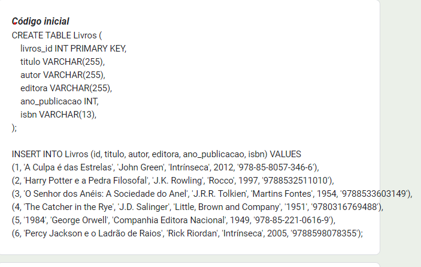

<h1 align="center"> Banco De Dados - Biblioteca Database </h1>
 
<h2 align="Center"> Banco de dados de uma Biblioteca </h2>
<h2 align="center">1ª PARTE - O Faxineiro Implacável. </h2>

Quando uma mancha indesejada aparece, ele não mede esforços para removê-la, mesmo que isso signifique desafiar as leis dos dados.  Hoje é dia de limpar as estantes, organizar livros e evoluir um pouco mais!

Um lugar para colocar nosso livros
Crie um banco de dados chamado Biblioteca.

Simples, né?

--  Crie um banco de dados chamado Biblioteca.
CREATE DATABASE IF NOT EXISTS Biblioteca;

USE Biblioteca;

-- Tirandos os livros das prateleiras. Abaixo estamos criando uma pequena biblioteca com livros.  
-- A criação da nossa estante é este Script abaixo, que possui erros que impedem renderização completa.

Você consegue encontrá-los?

 </img>

ALTER TABLE Livros
MODIFY isbn varchar(20);

INSERT INTO Livros (livros_id, titulo, autor, editora, ano_publicacao, isbn) VALUES 
(1, 'A Culpa é das Estrelas', 'John Green', 'Intrínseca', 2012, '978-85-8057-346-6'),
(2, 'Harry Potter e a Pedra Filosofal', 'J.K. Rowling', 'Rocco', 1997, '9788532511010'),
(3, 'O Senhor dos Anéis: A Sociedade do Anel', 'J.R.R. Tolkien', 'Martins Fontes', 1954, '9788533603149'),
(4, 'The Catcher in the Rye', 'J.D. Salinger', 'Little, Brown and Company', '1951', '9780316769488'),
(5, '1984', 'George Orwell', 'Companhia Editora Nacional', 1949, '978-85-221-0616-9'),
(6, 'Percy Jackson e o Ladrão de Raios', 'Rick Riordan', 'Intrínseca', 2005, '9788598078355');

 

<h2 align="Center">Retirando o pó</h2>
-- 1. Adicione a regra AUTO_INCREMENT para a chave primária e remova os dados referentes ao ID dos livros do script de inserção.

Drop Table Livros;

CREATE TABLE IF NOT EXISTS Livros (
    livros_id INT PRIMARY KEY AUTO_INCREMENT,
    titulo VARCHAR(255),
    autor VARCHAR(255),
    editora VARCHAR(255),
    ano_publicacao INT,
    isbn VARCHAR(20)
);

INSERT INTO Livros (titulo, autor, editora, ano_publicacao, isbn) VALUES 
('A Culpa é das Estrelas', 'John Green', 'Intrínseca', 2012, '978-85-8057-346-6'),
('Harry Potter e a Pedra Filosofal', 'J.K. Rowling', 'Rocco', 1997, '9788532511010'),
('O Senhor dos Anéis: A Sociedade do Anel', 'J.R.R. Tolkien', 'Martins Fontes', 1954, '9788533603149'),
('The Catcher in the Rye', 'J.D. Salinger', 'Little, Brown and Company', '1951', '9780316769488'),
('1984', 'George Orwell', 'Companhia Editora Nacional', 1949, '978-85-221-0616-9'),
('Percy Jackson e o Ladrão de Raios', 'Rick Riordan', 'Intrínseca', 2005, '9788598078355');

-- 2. Crie uma tabela para 'Autores' e outra para 'Editoras', para separar essas informações. 
-- Elas devem conter chaves primárias para gerar relacionamentos.
CREATE TABLE IF NOT EXISTS Autores (
    autor_id INT PRIMARY KEY AUTO_INCREMENT,
    nome VARCHAR(255),
    nacionalidade VARCHAR(255),
    data_nascimento DATE,
    biografia TEXT
);

CREATE TABLE IF NOT EXISTS Editoras (
	editora_id INT PRIMARY KEY AUTO_INCREMENT,
    nome VARCHAR(255),
    endereco VARCHAR(255),
    cidade VARCHAR(255),
    estado VARCHAR(255),
    pais VARCHAR(255),
    telefone VARCHAR(20),
    email VARCHAR(255)
);

-- 3. Utilizando ALTER TABLE, elimine as colunas 'autor' e 'editora' da tabela 'Livros' e 

ALTER TABLE Livros DROP COLUMN autor, DROP COLUMN editora;

-- adicione as colunas 'autor_id' e 'editora_id' para fazer a referências como chave estrangeiras das referidas tabelas.

ALTER TABLE Livros ADD COLUMN autor_id INT, ADD COLUMN editora_id INT;

-- Fazendo referências como chave estrangeiras 
ALTER TABLE Livros ADD CONSTRAINT fk_autor FOREIGN KEY (autor_id) REFERENCES Autores(autor_id);
ALTER TABLE Livros ADD CONSTRAINT fk_editora FOREIGN KEY (editora_id) REFERENCES Editoras(editora_id);

-- 4. Retire os valores para autores e para as editoras do script inicial e insira-os nas novas tabelas. 
ALTER TABLE Livros DROP COLUMN autor, DROP COLUMN editora;

-- Inserir valores na tabela 'Autores'
INSERT INTO Autores (nome, nacionalidade, data_nascimento, biografia)
VALUES ('John Green', 'Indianápolis', '1977-08-24', 'John Green é um renomado autor americano de ficção para jovens adultos.'),
       ('J.K. Rowling', 'Inglaterra', '1965-07-31', 'J.K. Rowling, cujo nome completo é Joanne Rowling, é uma escritora britânica.'),
       ('J.R.R. Tolkien', 'Bloemfontein', '1892-01-03', 'J.R.R. Tolkien, cujo nome completo é John Ronald Reuel Tolkien, foi um renomado escritor, poeta, professor universitário e filólogo britânico.'),
       ('J.D. Salinger', 'Nova York', '1919-01-01', 'J.D. Salinger, cujo nome completo é Jerome David Salinger, foi um renomado escritor americano.'),
       ('George Orwell', 'Nacionalidade 3', '1903-06-25', 'George Orwell, cujo nome verdadeiro era Eric Arthur Blair, foi um escritor e jornalista britânico.'),
	   ('Rick Riordan', 'Nacionalidade 3', '1964-06-05', 'Rick Riordan, cujo nome completo é Richard Russell Riordan Jr., é um escritor americano conhecido por suas populares séries de livros de fantasia para jovens adultos.');
-- Inserir valores na tabela 'Editoras'

INSERT INTO Editoras (nome, endereco, cidade, estado, pais, telefone, email)
VALUES ('Intrínseca', 'Rua Marquês de São Vicente, 99 / 6º andar Gávea - Rio de Janeiro - RJ', 'Rio de Janeiro', 'Rio de Janeiro', 'Brasil', '55 21 3206-7400', ' contato@intrinseca.com.br.'),
       ('Rocco', ' R. Dom Diniz, 56 - Jardim Luzitania, São Paulo - SP, 04032-080', 'São Paulo', 'São Paulo', 'Brasil', '(11) 3729-0244', 'rocco@rocco.com.br'),
       ('Martins Fontes', 'Martins Fontes Avenida Doutor Arnaldo, 2076 São Paulo - SP CEP: 01255-000', 'São Paulo', 'São Paulo', 'Brasil', '(11) 3116-0000', 'info@emartinsfontes.com.br'),
       ('Little, Brown and Company', 'Boston, Massachusetts, EUA', 'Boston, Massachusetts, EUA', 'Boston', 'EUA', '+44 (0)20 3122 7000', 'info@littlebrown.co.uk'),
       ('Companhia Editora Nacional', 'Condomínio Edifício Business Center - R. Gomes de Carvalho, 1306 - Vila Olímpia, São Paulo - SP, 04547-005', 'São Paulo', 'São Paulo', 'Brasil', '(11) 2169-7799', 'email3@example.com'),
       ('Intrínseca', 'Rua Marquês de São Vicente, 99 / 6º andar Gávea - Rio de Janeiro - RJ', 'Rio de Janeiro', 'Rio de Janeiro', 'Brasil', '55 21 3206-7400', ' contato@intrinseca.com.br.');
-- Colocando tudo no lugar
 -- O script abaixo seria para adicionar novos livros na sua biblioteca, mas com as mudanças feitas para normalização e higienização da base
 -- é necessário reestruturar a base abaixo para evitar problemas. 
 
 

<h3 align="center"> Os Segredos do Hospital. </h3>

INSERT INTO  Livros (titulo, ano_publicacao, isbn, autor_id, editora_id) 
VALUES 	('Grande Sertão: Veredas', 1956, '978-85-209-2325-1', 1, 1),
		('Memórias Póstumas de Brás Cubas', 1881, '9788535910663', 2, 2),
		('Vidas Secas', 1938, '9788572326972', 3, 3),
		('O Alienista', 1882, '9788572327429', 2, 4),
		('O Cortiço', 1890, '9788579027048', 4, 5),
		('Dom Casmurro', 1899, '9788583862093', 2, 5),
		('Macunaíma', 1928, '9788503012302', 6, 3);
